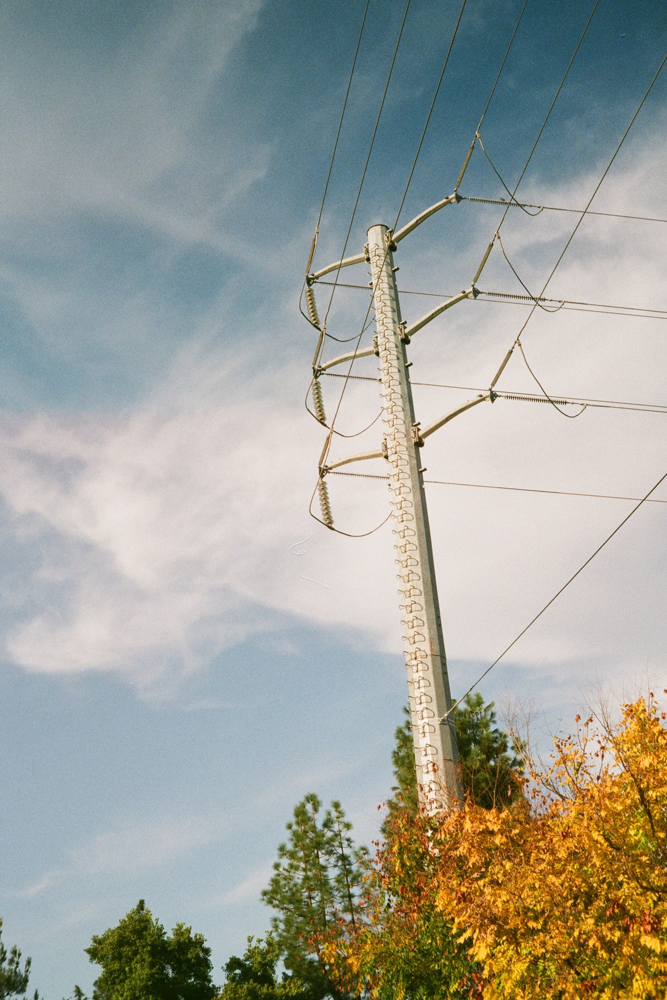

And this is the body.

# This is first level heading (H1).

She was infatuated with color. She didn't have a favorite color per se, but she did have a fondness for teals and sea greens.

## This is a second level heading (H2).

He walked down the steps from the train station in a bit of a hurry knowing the secrets in the briefcase must be secured as quickly as possible. Bounding down the steps, he heard something behind him and quickly turned in a panic.

### This is a third level heading (H3).

I recently discovered I could make fudge with just chocolate chips, sweetened condensed milk, vanilla extract, and a thick pot on slow heat. I tried it with dark chocolate chunks and I tried it with semi-sweet chocolate chips. It's better with both kinds.

#### This is a fourth level heading (H4).

There was little doubt that the bridge was unsafe. All one had to do was look at it to know that with certainty. Yet Bob didn't see another option. He may have been able to work one out if he had a bit of time to think things through, but time was something he didn't have.

##### This is a fifth level heading (H5).

He hid under the covers hoping that nobody would notice him there. It really didn't make much sense since it would be obvious to anyone who walked into the room there was someone hiding there, but he still held out hope.

###### This is a sixth level heading but who really uses (H6)?

She glanced up into the sky to watch the clouds taking shape. First, she saw a dog. Next, it was an elephant. Finally, she saw a giant umbrella and at that moment the rain began to pour.

> this is a block quote, She nervously peered over the edge. She understood in her mind that the view was supposed to be beautiful, but all she felt was fear.

